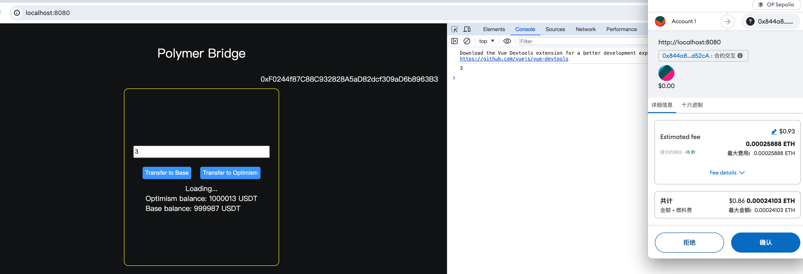

## Project title
Polymer IBC bridge

## Team members
wulingzhiyi

### Assets: 
```
pumpkin blue basic arena chimney seat electric give cool song pizza excess
```

## Project Overview
Users can cross-chain their USDT assets from Optimism to Base via IBC, and they can also send from Optimism to Base.

## Run-book
- Install deps and start
```
npm install && npm run serve
```

2. Import a account from Metamask by using mnemonic, add sepolia-op and sepolia-base chain to metamask
3. Add USDT token by using Metamsk (0x844a848Ed12be1D39518d6706d66Bed24c9d52cA)
4. Transfer your tokens between op and base
## Resources Used
    bignumber.js, web3.js

## Future Improvements
Support more chains, improve UI

## Tx hash
Optimism tx hash: [0xae4057c2e35295f03561154bfb67f5d6a9f1981e7e556ccc938b931a6dce117b](https://optimism-sepolia.blockscout.com/tx/0xae4057c2e35295f03561154bfb67f5d6a9f1981e7e556ccc938b931a6dce117b?tab=index)
Base tx hash: [0x083aab2d8ab6f17e4fab4ee4b18ea9dc887f71c87c660ebd7c97eba8300acbf7](https://base-sepolia.blockscout.com/tx/0x083aab2d8ab6f17e4fab4ee4b18ea9dc887f71c87c660ebd7c97eba8300acbf7?tab=index)


## PortAddress
Op: 0x844a848Ed12be1D39518d6706d66Bed24c9d52cA
Base: 0x844a848Ed12be1D39518d6706d66Bed24c9d52cA



## Licence
[Apache 2.0](LICENSE)


